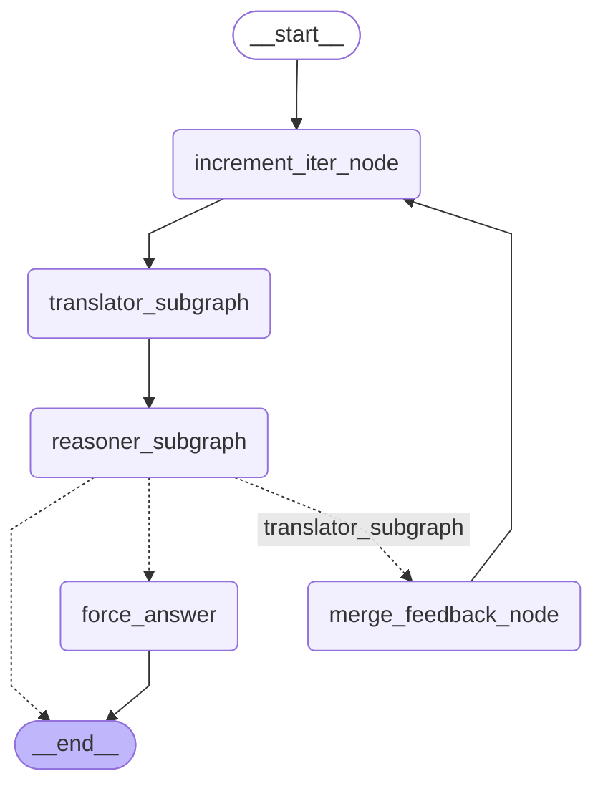

# SeeingEye — LangGraph Implementation

A LangGraph rebuild of the SeeingEye flow (Zhang et al., UIUC, arXiv
[2510.25092](https://arxiv.org/abs/2510.25092), Oct 2025) — a modular
framework that unlocks multimodal reasoning in text-only LLMs by decoupling
perception (a small VLM Translator Agent) from reasoning (a text-only LLM
Reasoning Agent), connected by a Structured Intermediate Representation
(SIR) and a feedback-driven Agentic Information Flow.

This repo implements the paper's Algorithm 1 as a LangGraph state graph
with per-agent subgraphs, paper-frozen prompts, and explicit SIR merge
semantics. The old OpenManus-derived implementation (`src/multi-agent/`)
was deleted in Phase 7 (2026-04-17); the sole authoritative implementation
is now `src/seeingeye/`.

> **Reproducibility status (v1.0, 2026-04-17):** Phase 6 parity validation
> was **deferred to post-migration**. The tree is code-complete with 146
> structural tests passing (plus 1 integration test skipped pending a live
> vLLM cluster) but is **NOT empirically verified against the paper's
> published accuracies** (MMMU val 60.78%, MMMU-Pro std 44.62%,
> MMMU-Pro vis 33.33%, OCR-BenchV2 33.99%, MIA-Bench 84.10%). See
> [SECURITY.md](./SECURITY.md) for the full risk-acceptance record.

> **Aeyez local validation:** the parent Aeyez app includes a measured
> 250-question MMMU custom hardset run at **220 / 250 correct = 88.0%**.
> That artifact is stored at
> [`../benchmark_results/mmmutest.jsonl`](../benchmark_results/mmmutest.jsonl)
> and is separate from the original paper leaderboard numbers above.

## Quick Start

**Default configuration:** OpenAI-compatible API with `gpt-5.4-mini` as the
Translator, Translator escalation model, and Reasoner model. Local vLLM
remains supported by overriding the endpoint/model env vars.

```bash
# 1. Create venv and install
cd /path/to/seeingeye
python3 -m venv .venv
source .venv/bin/activate
pip install -e .

# 2. Configure OpenAI
cp .env.example .env
# Edit .env and set OPENAI_API_KEY to your API key

# 3. Check setup
python run_seeingeye.py --doctor

# 4. Run a question from the repo CLI
python run_seeingeye.py \
  --question 'What color is the sky in this image?' \
  --image path/to/image.png
```

Video input samples frames from the video and sends them as chronological
vision inputs. The sampling interval is user-controlled from 0.1 to 1.0
seconds:

```bash
python run_seeingeye.py \
  --question 'What happens in this video?' \
  --video path/to/video.mp4 \
  --frame-interval 0.5
```

The `run_question()` API returns a `SeeingEyeResult` dataclass with
`answer: str`, `sir: SIR`, `outer_iters_used: int`, `total_tokens: int`.

## Usage

### CLI

Doctor / preflight:

```bash
python run_seeingeye.py --doctor
```

Plain-text answer:

```bash
python run_seeingeye.py \
  --question 'What color is the sky in this image?' \
  --image path/to/image.png
```

Multiple choice:

```bash
python run_seeingeye.py \
  --question 'Which option is correct?' \
  --image path/to/image.png \
  --option 'A. Red' \
  --option 'B. Blue' \
  --option 'C. Green'
```

Full JSON output:

```bash
python run_seeingeye.py \
  --question 'Which option is correct?' \
  --image path/to/image.png \
  --option 'A. Red' \
  --option 'B. Blue' \
  --json
```

Show the final SIR text:

```bash
python run_seeingeye.py \
  --question 'Describe the chart.' \
  --image path/to/image.png \
  --show-sir
```

You can also run the CLI as a module:

```bash
python -m src.seeingeye --question 'Describe the image.' --image path/to/image.png
```

### Python API

```bash
python -c "
import asyncio
from src.seeingeye.runtime import run_question
result = asyncio.run(run_question(
    question='What color is the sky in this image?',
    image_path='path/to/image.png',
    options=None,
))
print(result.answer)
print(result.sir.content)
"
```

## Current Status

- Local install works with `pip install -e .`
- Structural tests pass locally
- This machine is better suited to a remote OpenAI-compatible backend than local vLLM
- `.env` is supported, so you can keep your API key in the project root without exporting it every time

## OpenAI Configuration

SeeingEye defaults to OpenAI's API:

- Base URL: `https://api.openai.com/v1`
- Translator model: `gpt-5.4-mini`
- Translator escalation model: `gpt-5.4-mini`
- Reasoner model: `gpt-5.4-mini`

Minimal `.env`:

```env
OPENAI_API_KEY=your_openai_api_key_here
SEEINGEYE_TRANSLATOR_BASE_URL=https://api.openai.com/v1
SEEINGEYE_REASONER_BASE_URL=https://api.openai.com/v1
SEEINGEYE_TRANSLATOR_MODEL=gpt-5.4-mini
SEEINGEYE_TRANSLATOR_ESCALATION_MODEL=gpt-5.4-mini
SEEINGEYE_REASONER_MODEL=gpt-5.4-mini
SEEINGEYE_VIDEO_FRAME_INTERVAL_S=0.5
SEEINGEYE_VIDEO_MAX_FRAMES=64
```

For long videos, `SEEINGEYE_VIDEO_MAX_FRAMES` protects the request from growing
without bound; raise it if your model/account can handle more images per call.

## Architecture



- **Translator subgraph** (`src/seeingeye/agents/translator/`) —
  `gpt-5.4-mini` on the first pass, then `gpt-5.4-mini` after Reasoner feedback.
  It accepts one image or chronological video frames, then dispatches visual
  tools (OCR, ReadTable, SmartGridCaption) from Python based on parsed VCoT
  text.
- **Reasoner subgraph** (`src/seeingeye/agents/reasoner/`) —
  `gpt-5.4-mini` by default. Uses
  `ChatOpenAI.bind_tools([...], tool_choice="auto")` for the three-way
  terminal decision (`terminate_and_answer`,
  `terminate_and_ask_translator`, `continue_reasoning`). Non-streaming.
- **Force-answer node** — reached when `MAX_ITERS=3` is exhausted without
  `terminate_and_answer`. Binds only `terminate_and_answer`
  (see [SECURITY.md §3](./SECURITY.md) OR-04-02-01 for deviation note).
- **State** — `SeeingEyeState` TypedDict with explicit
  `translator_messages` / `reasoner_messages` isolation via subgraph
  schemas. SIR is a Pydantic v2 model with explicit `merge_feedback()`
  and `replace()` methods.

## Project Structure

```
src/seeingeye/           # Sole authoritative implementation
├── agents/              # Translator + Reasoner subgraphs
├── config/              # pydantic-settings (env-var only)
├── graph/               # Parent StateGraph builder + routing
├── llm/                 # ChatOpenAI client with extra_body passthrough
├── observability/       # loguru JSONL sink
├── prompts/             # 4 paper-frozen prompt files (# DO NOT EDIT)
├── runtime/             # run_question() public API + SeeingEyeResult
├── state/               # SeeingEyeState TypedDict + SIR Pydantic model
└── tools/               # OCR, ReadTable, SmartGridCaption + 3 @tool decisions

benchmark_evaluation/    # Paper's benchmark harnesses — preserved for
                         # future re-activation. Imports are INTENTIONALLY
                         # broken (they expect the deleted legacy tree);
                         # re-activation requires a FlowExecutor adapter
                         # (deferred Phase 6 PAR-01).

tests/                   # 146 structural tests (Phase 2-5, post-Phase-7 trim)
```

## Development

```bash
# Run the full test suite
python -m pytest tests/ -q

# One-off run (matches Quick Start above)
python -c "import asyncio; from src.seeingeye.runtime import run_question; ..."
```

Tests use `from src.seeingeye.*` imports (established convention).
LangGraph subgraph isolation + SIR immutability + paper-frozen prompts
are all covered structurally. Benchmark-accuracy testing is deferred
(see [SECURITY.md §2](./SECURITY.md)).

## Migration History

See [SECURITY.md](./SECURITY.md) for the v1.0 risk-acceptance record
(credential history, empirical validation gap, unverified deviations).

## License

MIT. See [LICENSE](./LICENSE).
